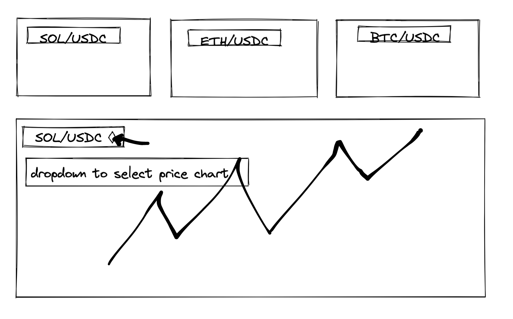

# Improvements

## High

> Allow for increasing an existing prediction's amount while predictions are still allowed  
> On the frontend, calculate the time remaining from the start time for a better UX (instead of using what the chain says)  
> When round is switching, don't hide the games  
> Change Layout for better UX  
> 
## Medium

> Round History  
> Prediction History

# Bugs
